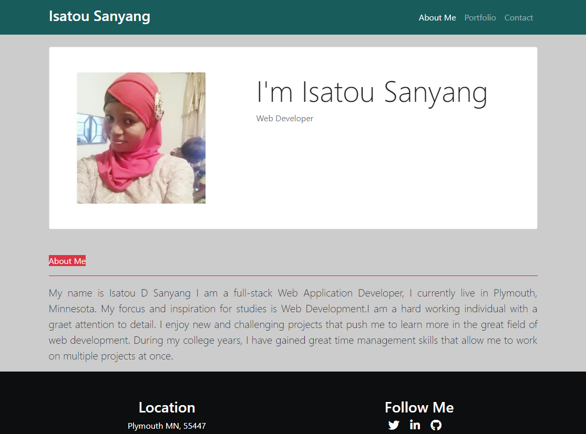
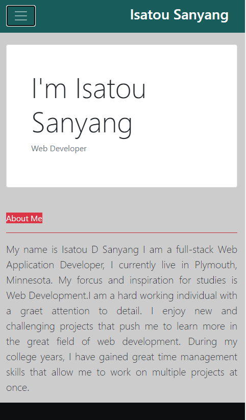
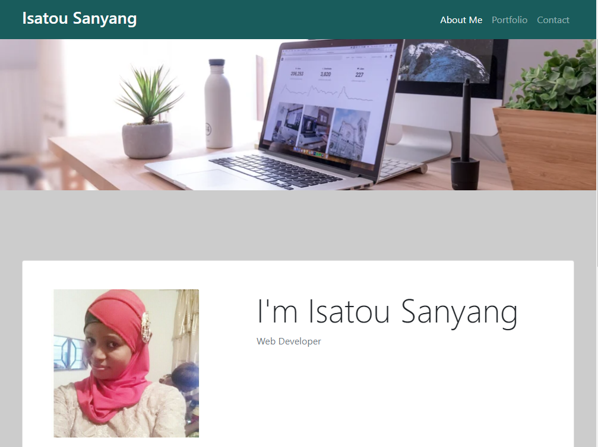
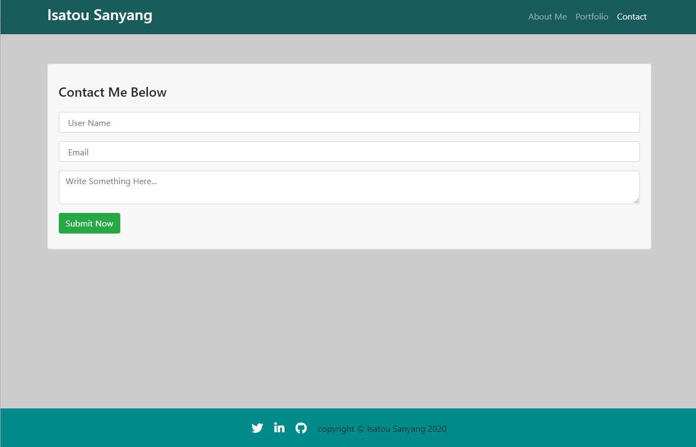
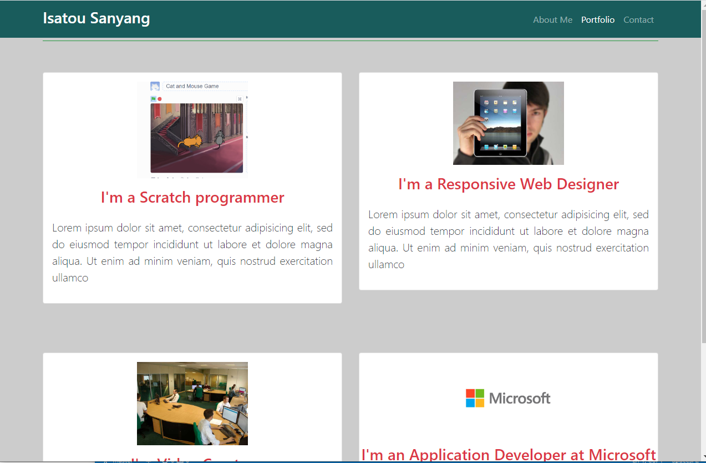

# Responsive portfolio Pages
This is a responsive portfolio page created with Bootstrap framework

Bootstrap navbar-inverse use to change the color of header and footer

## This is how the page looks like when browser is resize

